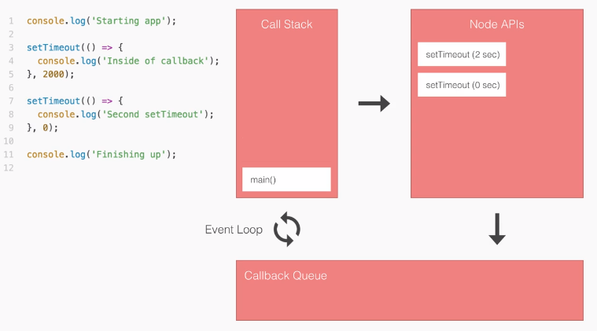

# Node.js

> Source: <https://www.freecodecamp.org/news/what-exactly-is-node-js-ae36e97449f5/>

## Node.js is a JavaScript runtime environment. Sounds great, but what does that mean? How does that work

The Node.js run-time environment includes everything you need to execute a program written in JavaScript.


If you know Java, here’s a little analogy.

Node.js came into existence when the original developers of JavaScript extended it from something you could only run in the browser to something you could run on your machine as a standalone application.

Now you can do much more with JavaScript than just making websites interactive.

JavaScript now has the capability to do things that other scripting languages like Python can do.

Both your browser JavaScript and Node.js run on the V8 JavaScript runtime engine. This engine takes your JavaScript code and converts it into a faster machine code. Machine code is low-level code which the computer can run without needing to first interpret it.

## Why Node.js

Here’s a formal definition as given on the official Node.js website:

> Node.js® is a JavaScript runtime built on Chrome’s V8 JavaScript engine.
>
> Node.js uses an event-driven, non-blocking I/O model that makes it lightweight and efficient.
>
> Node.js’ package ecosystem, npm, is the largest ecosystem of open source libraries in the world.

We already discussed the first line of this definition: “Node.js® is a JavaScript runtime built on Chrome’s V8 JavaScript engine.” Now let’s understand the other two lines so we can find out why Node.js is so popular.

I/O refers to input/output. It can be anything ranging from reading/writing local files to making an HTTP request to an API.

I/O takes time and hence blocks other functions.

Consider a scenario where we request a backend database for the details of user1 and user2 and then print them on the screen/console. The response to this request takes time, but both of the user data requests can be carried out independently and at the same time.


### Blocking I/O

In the blocking method, user2's data request is not initiated until user1's data is printed to the screen.

If this was a web server, we would have to start a new thread for every new user. But JavaScript is single-threaded (not really, but it has a single-threaded event loop, which we’ll discuss a bit later). So this would make JavaScript not very well suited for multi-threaded tasks.

That’s where the non-blocking part comes in.

### Non-blocking I/O

On the other hand, using a non-blocking request, you can initiate a data request for user2 without waiting for the response to the request for user1. You can initiate both requests in parallel.

This non-blocking I/O eliminates the need for multi-threading since the server can handle multiple requests at the same time.

### The JavaScript event loop

If you have 26 minutes, watch this excellent video explanation of the Node Event Loop:

<YoutubeVideo video-id="8aGhZQkoFbQ" />

Otherwise, here’s a quick step-by-step explanation of how the JavaScript Event Loop works.



1. Push `main()` onto the call stack.
2. Push `console.log()` onto the call stack. This then runs right away and gets popped.
3. Push `setTimeout(2000)` onto the stack. `setTimeout(2000)` is a Node API. When we call it, we register the event-callback pair. The event will wait 2000 milliseconds, then callback is the function.
4. After registering it in the APIs, `setTimeout(2000)` gets popped from the call stack.
5. Now the second `setTimeout(0)` gets registered in the same way. We now have two Node APIs waiting to execute.
6. After waiting for 0 seconds, `setTimeout(0)` gets moved to the callback queue, and the same thing happens with setTimeout(2000).
7. In the callback queue, the functions wait for the call stack to be empty, because only one statement can execute a time. This is taken care of by the event loop.
8. The last `console.log()` runs, and the `main()` gets popped from the call stack.
9. The event loop sees that the call stack is empty and the callback queue is not empty. So it moves the callbacks (in a first-in-first-out order) to the call stack for execution.

## NPM


These are libraries built by the awesome community which will solve most of your generic problems. npm (Node package manager) has packages you can use in your apps to make your development faster and efficient.

### Require

Require does three things:

* It loads modules that come bundled with Node.js like file system and HTTP from the Node.js API .
* It loads third-party libraries like Express and Mongoose that you install from npm.
* It lets you require your own files and modularize the project.

Require is a function, and it accepts a parameter “path” and returns `module.exports`.

### Node Modules

A Node module is a reusable block of code whose existence does not accidentally impact other code.

You can write your own modules and use it in various application. Node.js has a set of built-in modules which you can use without any further installation.

### V8 turbo-charges JavaScript by leveraging C++

V8 is an open source runtime engine written in C++.

JavaScript -> V8(C++) -> Machine Code

V8 implements a script called ECMAScript as specified in ECMA-262. ECMAScript was created by Ecma International to standardize JavaScript.

V8 can run standalone or can be embedded into any C++ application. It has hooks that allow you to write your own C++ code that you can make available to JavaScript.

This essentially lets you add features to JavaScript by embedding V8 into your C++ code so that your C++ code understands more than what the ECMAScript standard otherwise specifies.

Edit: As brought to my attention by Greg Bulmash, there are many different JavaScript runtime engines apart from V8 by Chrome like SpiderMonkey by Mozilla, Chakra by Microsoft, etc. Details of the same can be found on this page.

## Events

Something that has happened in our app that we can respond to. There are two types of events in Node.

* System Events: C++ core from a library called libuv. (For example, finished reading a file).
* Custom Events: JavaScript core.

## Writing Hello World in Node.js

We have to do this, don’t we?

Make a file app.js and add the following to it.

```javascript
console.log("Hello World!");
```

Open your node terminal, change the directory to the folder where the file is saved and `run node app.js`.

Bam — you’ve just written Hello World in Node.js.
